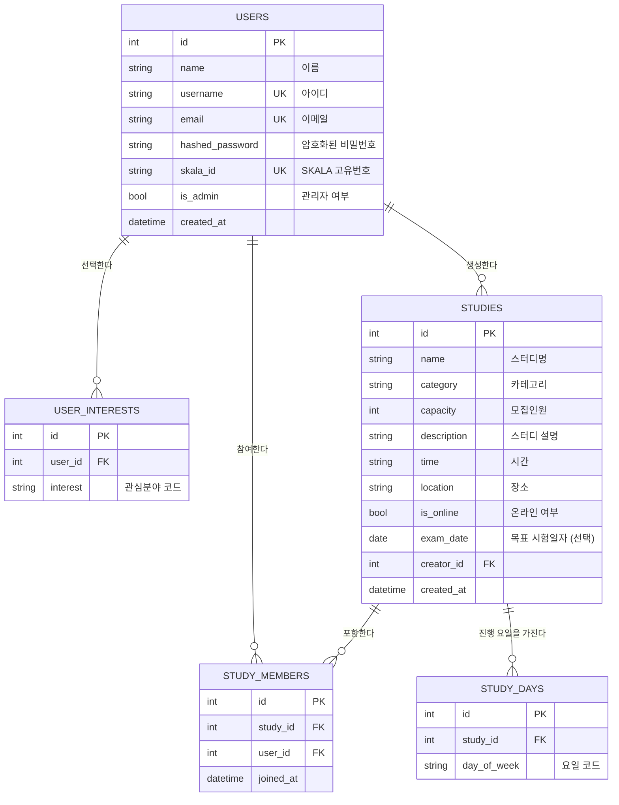

# SKALA STUDY - 데이터베이스 설계 (ERD)

## 1. 개요

SKALA STUDY는 SKALA 교육생 전용 스터디 매칭 플랫폼입니다.
아래는 서비스에 필요한 테이블 구조와 관계를 정의합니다.

## 2. 테이블 목록

| 테이블명 | 설명 |
|---|---|
| users | 회원 정보 |
| user_interests | 회원의 관심분야 (다대다) |
| studies | 스터디 정보 |
| study_days | 스터디가 진행되는 요일 (1:N, 복수 선택) |
| study_members | 스터디 참여 회원 (다대다) |

## 3. ERD (Mermaid)

## 4. 필드 상세 및 Enum 정의

### 4.1 관심분야 / 스터디 카테고리 (`category`, `interest`)

| 그룹 | 코드 | 라벨 |
|---|---|---|
| 영어 | OPIC | OPIC |
| 영어 | TOEIC | TOEIC |
| 영어 | TOEIC_SPEAKING | TOEIC Speaking |
| 자격증 | SQLD | SQLD |
| 자격증 | INFO_PROCESSING_WRITTEN | 정보처리기사 필기 |
| 자격증 | INFO_PROCESSING_PRACTICAL | 정보처리기사 실기 |
| 기타 | CLASS_STUDY | 수업스터디 |
| 기타 | ETC | 기타 |

- 회원가입 시 `user_interests`에 복수 선택하여 저장 (다대다)
- 스터디 생성 시 `studies.category`는 위 코드 중 하나를 선택 (단일)

### 4.2 요일 (`study_days.day_of_week`)

`MON, TUE, WED, THU, FRI, SAT, SUN`

- 스터디 하나가 여러 요일을 가질 수 있도록 `study_days` 테이블로 분리 (월수금, 주말, 매일 등 자유 조합)
- 응답 시 선택된 요일 조합에 따라 사람이 읽기 좋은 라벨을 자동 계산: 7일 전체 → `매일`, 토·일 → `주말`, 월~금 → `평일`, 그 외 → `월·수·금`처럼 `·`로 연결

### 4.2.1 목표 시험일자 (`studies.exam_date`)

- 자격증/어학 시험을 목표로 하는 스터디를 위한 선택적 날짜 필드 (nullable)
- 수업스터디, 기타 등 시험이 없는 스터디는 비워둘 수 있음

### 4.3 장소 (`location`)

| 코드 | 라벨 |
|---|---|
| CLASSROOM | 강의실 |
| LOUNGE | 라운지 |
| CAFE | 카페 |
| ONLINE | 온라인 |
| ETC | 기타 |

### 4.4 관계 요약

- `users 1 : N studies` (creator_id) - 한 회원이 여러 스터디를 생성
- `users N : M studies` (study_members) - 회원은 여러 스터디에 참여, 스터디는 여러 회원을 가짐
- `users 1 : N user_interests` - 회원은 여러 관심분야를 가짐
- `studies 1 : N study_days` - 스터디는 여러 요일에 진행될 수 있음

## 5. 인덱스 / 제약조건

- `users.username`, `users.email`, `users.skala_id` : UNIQUE
- `study_members(study_id, user_id)` : UNIQUE (중복 참여 방지)
- `study_days(study_id, day_of_week)` : UNIQUE (같은 요일 중복 저장 방지)
- 스터디 참여 시 `study_members` 개수가 `studies.capacity` 미만인지 애플리케이션 레벨에서 검증
